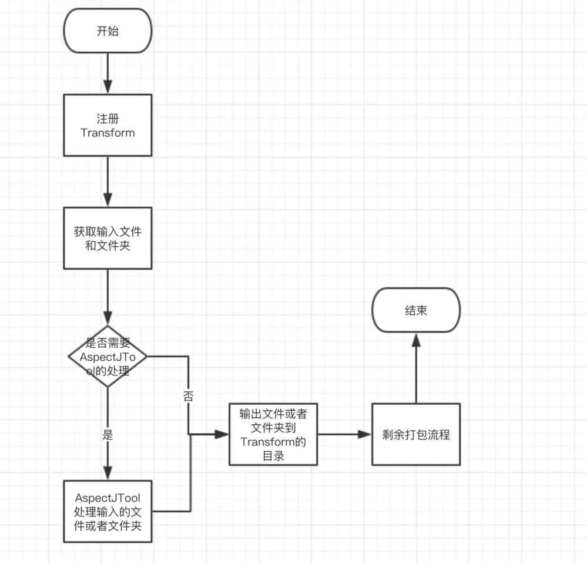

## AspectJ Gradle 插件

#### 缺点
1. ~~目前不支持Kotlin~~    【已完成】
2. 不支持编译特定文件，如果文件太多会导致编译时间过长
3. 当出现错误情况的是，可能导致AspectJTools 没有退出,需要退出程序

### 相关说明
>spring-aop：AOP核心功能，例如代理工厂等等

```
      Main().run(arrayOf, handler) // 关键句子执行AOP
```

>aspectjweaver：简单理解，支持切入点表达式等等

>aspectjrt：简单理解，支持aop相关注解等等


### 集成
1. 项目`build.gradle`
```
    repositories {
        maven{
            maven { url "https://jitpack.io" }
        }
    }

    dependencies {
        classpath 'com.github.SheTieJun.PluginLib:AspectJPlguin:-SNAPSHOT'
    }
```

2. 同时需要在app 下的`build.gradle`
```
apply plugin: 'shetj.plugin.aspectj'
```


#### 查看文件生成位置 ：新的方式是通过transform
[编译生成文件](/app/build/intermediates/transforms/)：/app/build/intermediates/transforms/AspectJPlugin


#### AspectJ编译时期
**编译时织入**，利用ajc编译器替代javac编译器，直接将源文件(java或者aspect文件)编译成class文件并将切面织入进代码。

**编译后织入**，利用ajc编译器向javac编译期编译后的class文件或jar文件织入切面代码。

**加载时织入**，不使用ajc编译器，利用aspectjweaver.jar工具，使用java agent代理在类加载期将切面织入进代码。

### 测试结果
1. Java 成功了
2. Kotlin 失败了，暂时没有原因

### 建议使用下面这个大佬的库

[**gradle_plugin_android_aspectjx**](https://github.com/HujiangTechnology/gradle_plugin_android_aspectjx)

1. 同时支持Java/Kotlin

2. 支持只编译特定的包名文件，减少编译时间
  

  



### 更新日志
1. 2021年4月9日：支持kotlin 【已完成】


